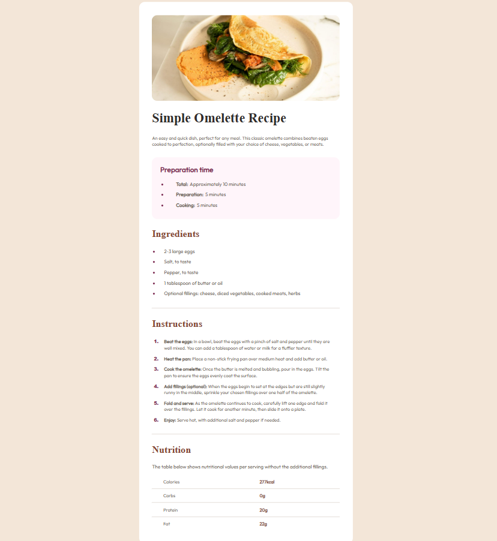
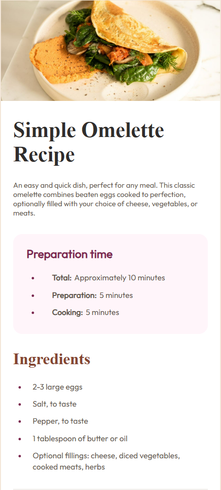

# Frontend Mentor - Recipe page component solution

This is a solution to the [Recipe page code component challenge on Frontend Mentor](https://www.frontendmentor.io/challenges/qr-code-component-iux_sIO_H).
## Table of contents

- [Overview](#overview)
    - [Screenshot](#screenshot)
    - [Links](#links)
- [My process](#my-process)
    - [Built with](#built-with)
    - [What I learned](#what-i-learned)
    - [Continued development](#continued-development)
    - [Useful resources](#useful-resources)
- [Author](#author)

## Overview

### Screenshot

- The desktop version

- The mobile version

### Links

- Solution URL: [Click Here](https://github.com/che3zcake/frontend_mentor/tree/main/recipe-page-main)
- Live Site URL: [Click Here](https://frontend-mentor-r58w.vercel.app/)

## My process

### Built with

- Semantic HTML5 markup
- CSS custom properties
- CSS Grid
- Traditional CSS

### What I learned

I have been using frameworks a lot to make my frontend like react and tailwind for style more than I have ever used the traditional CSS, so for me, it was a fun challenge where I used the traditional CSS, learned a lot of things like how to center a div using transform: translate.
Learned how to get custom font family and text color.

The snippet below is what I learned and implemented to center the div component in the parent div

### Continued development

Even tho I love using tailwind for styling, I will try to use the traditional CSS more for the challenges where ever I can. It is fun but gets confusing as it gets hard to track, maybe It is just my skill issue, but hopefully it will grow on me more (it already has a little bit)

### Useful resources

- [https://www.w3schools.com/](https://www.w3schools.com/) - This has helped me with the media query for making the site responsive
- [Centering the div in the parent div/body](https://www.dhiwise.com/post/crafting-the-perfect-website-how-to-center-a-div-in-your-code) - This site showed me multiple ways to center a div in a parent div and here I learned to use the transform: translate method.
## Author

- Website - [Lawrence Sharma](https://frontend-mentor-r58w.vercel.app/)
- Frontend Mentor - [@che3zcake](https://www.frontendmentor.io/profile/che3zcake)
- Twitter - [@che3zcake](https://www.twitter.com/che3zcake)

